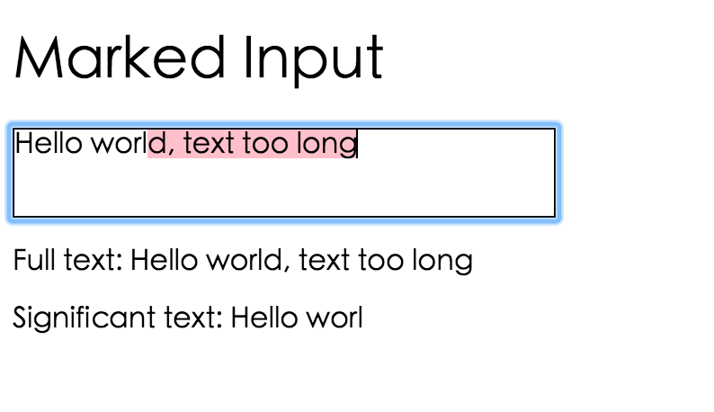

Marked Input
===


Make your input box markable. Mark the unexpected text in your input box.

[Demo](https://gera2ld.github.io/marked-input/)

Installation
---
``` sh
npm i marked-input
```

Usage
---
``` html
<style>
#input > em {
  background: yellow;
  font-style: normal;
}
</style>
<div id="input"></div>
```

``` js
// Via NPM
const markedInput = require('marked-input');

// Via global, you'll get global variable `markedInput`

markedInput.init({
  el: '#input',
  splitText: 10,  // text longer than 10 chars will be marked
  onChange: text => {
    console.log(`Significant text: ${text}`);
  },
});
```

Snapshots
---

